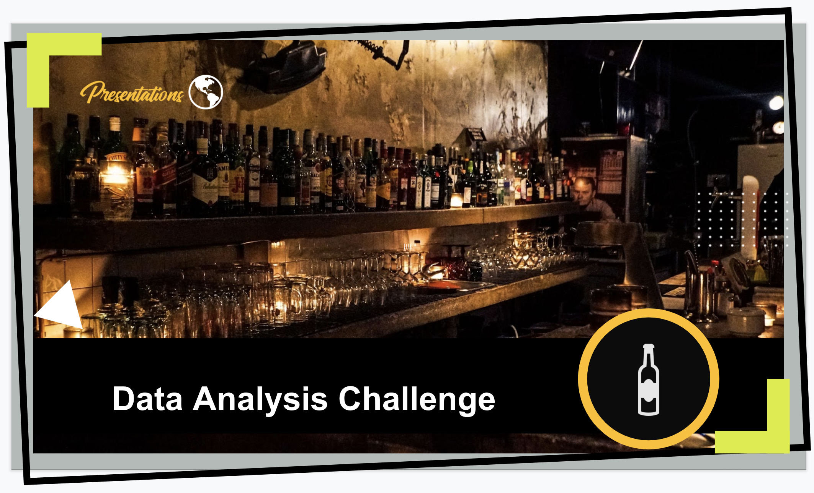

# Wine Analysis

 

  

## Introduction
In data science world, it's very important that being able to communicate the results that we gather. One of the most important things to consider when presenting data is the audience we are targeting. This excerise gathering insights and communicating them to different audiences. 

## Problem Targert (Marketing)
Problem Statement: Which wine attributes are related to customers rating wines as good vs. bad?

Our team set out to understand the attributes of positively reviewed Vinho Verde wines.  
Our motivation is to provide customer insights for product development to empower our client WineNot to produce a top reviewed Vinho Verde variant.

## Dataset Information

The two datasets are related to red and white variants of the Portuguese "Vinho Verde" wine. For more details, consult: [Web Link] or the reference [Cortez et al., 2009]. Due to privacy and logistic issues, only physicochemical (inputs) and sensory (the output) variables are available (e.g. there is no data about grape types, wine brand, wine selling price, etc.).

Dataset link: https://archive.ics.uci.edu/ml/datasets/wine+quality  

## Team Members
- Austin Yu 
- Ian Fan
- Brandon Clark

## Completion Time
* Within 3 hours
